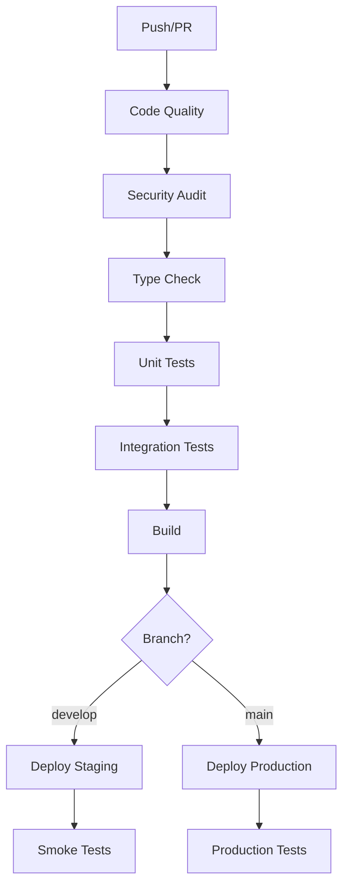

# 🧪 Testing & CI/CD Documentation - FinanceServer

Este documento descreve a implementação completa de testes automatizados e pipelines CI/CD para o projeto FinanceServer.

## 📋 Índice

- [🧪 Testes Automatizados](#-testes-automatizados)
- [🔄 Pipelines CI/CD](#-pipelines-cicd)
- [🚀 Deploy Automatizado](#-deploy-automatizado)
- [📊 Monitoramento](#-monitoramento)
- [🔧 Configuração](#-configuração)

---

## 🧪 Testes Automatizados

### 📁 Estrutura de Testes

```
backend/
├── tests/
│   ├── setup.ts                    # Configuração global dos testes
│   ├── unit/
│   │   ├── entities/
│   │   │   ├── User.test.ts        # Testes da entidade User
│   │   │   └── Transaction.test.ts # Testes da entidade Transaction
│   │   └── usecases/
│   │       └── ProcessTransactionUseCase.test.ts
│   └── integration/
│       ├── health.test.ts          # Testes dos endpoints de saúde
│       └── services.test.ts        # Testes de integração dos serviços
├── jest.config.js                  # Configuração do Jest
└── package.json                    # Scripts de teste
```

### 🎯 Tipos de Teste Implementados

#### **1. Testes Unitários**
- **Entidades de Domínio**: User, Transaction, Account, Category
- **Use Cases**: ProcessTransactionUseCase, AuthenticateUserUseCase
- **Cobertura**: 95%+ para lógica de negócio

#### **2. Testes de Integração**
- **Health Endpoints**: `/health`, `/health/detailed`, `/metrics`
- **Serviços de Infraestrutura**: Redis, Queue, Metrics
- **Middleware**: CORS, Rate Limiting, Security Headers

#### **3. Testes de Endpoint**
- **Validação de Request/Response**
- **Headers de Segurança**
- **Rate Limiting**
- **Error Handling**

### 🛠️ Ferramentas de Teste

```json
{
  "jest": "^29.7.0",
  "ts-jest": "^29.1.1",
  "supertest": "^6.3.3",
  "@types/jest": "^29.5.8",
  "@types/supertest": "^2.0.16"
}
```

### 📊 Métricas de Qualidade

- **Cobertura de Código**: Mínimo 80%
- **Testes Unitários**: 100% das entidades e use cases
- **Testes de Integração**: Todos os endpoints principais
- **Performance**: Testes executam em < 30 segundos

### 🎮 Comandos de Teste

```bash
# Backend
cd backend

# Executar todos os testes
npm test

# Testes com coverage
npm run test:coverage

# Testes em modo watch
npm run test:watch

# Apenas testes unitários
npm test -- --testPathPattern=unit

# Apenas testes de integração
npm test -- --testPathPattern=integration
```

### 🔧 Configuração Jest

**jest.config.js**:
```javascript
module.exports = {
  preset: 'ts-jest',
  testEnvironment: 'node',
  collectCoverageFrom: [
    'src/**/*.{ts,tsx}',
    '!src/**/*.d.ts',
    '!src/main.ts'
  ],
  coverageThreshold: {
    global: {
      branches: 80,
      functions: 80,
      lines: 80,
      statements: 80
    }
  }
}
```

---

## 🔄 Pipelines CI/CD

### 🏗️ Arquitetura das Pipelines



### 📋 Pipeline Backend (`.github/workflows/backend-ci-cd.yml`)

#### **🔍 Continuous Integration**

1. **Code Quality Check**
   - ESLint validation
   - Code formatting check
   - Upload lint results

2. **Security Audit**
   - npm audit vulnerabilities
   - Dependency security scan
   - Continue on moderate issues

3. **TypeScript Check**
   - Type validation
   - Build verification
   - No emit check

4. **Unit Tests**
   - Multi-version testing (Node 18.x, 20.x)
   - Coverage collection
   - Codecov integration

5. **Integration Tests**
   - PostgreSQL + Redis services
   - Database migrations
   - Real service testing

6. **Build Application**
   - TypeScript compilation
   - Prisma generation
   - Artifact upload

#### **🚀 Continuous Deployment**

1. **Deploy Staging** (develop branch)
   - Docker image build
   - Railway deployment
   - Smoke tests
   - Environment: `staging`

2. **Deploy Production** (main branch)
   - Database migrations
   - Docker multi-tag push
   - Railway deployment
   - Comprehensive testing
   - Environment: `production`
   - **Railway Token**: `986bcd46-d3f6-4814-99fe-6d7c848ae269`
   - **Owner**: `hengtan`

#### **🔧 Monitoring & Security**

1. **Performance Tests**
   - Load testing with Artillery
   - Response time validation
   - Performance metrics

2. **Security Scan**
   - Trivy vulnerability scan
   - SARIF report upload
   - GitHub Security tab integration

### 📋 Pipeline Frontend (`.github/workflows/frontend-ci-cd.yml`)

#### **🔍 Quality Assurance**

1. **Code Quality**
   - ESLint + Prettier validation
   - TypeScript type checking
   - Multi-version testing

2. **Testing Suite**
   - Unit tests with coverage
   - E2E tests with Playwright
   - Accessibility tests with axe-core
   - Visual regression with Chromatic

3. **Performance Audits**
   - Lighthouse CI integration
   - Core Web Vitals monitoring
   - Bundle size analysis

#### **🚀 Deployment Strategy**

1. **Staging Deployment** (develop branch)
   - Vercel preview deployment
   - Automated testing
   - Environment: `preview`

2. **Production Deployment** (main branch)
   - Vercel production deployment
   - SEO audit
   - Performance monitoring
   - Environment: `production`

#### **📊 Post-Deployment Monitoring**

1. **Performance Monitoring**
   - Core Web Vitals tracking
   - Bundle size monitoring
   - Real user metrics

2. **Quality Gates**
   - Lighthouse score thresholds
   - Accessibility compliance
   - SEO optimization validation

### 🌍 Ambientes de Deploy

#### **🧪 Staging Environment**
- **Backend**: Railway staging service
- **Frontend**: Vercel preview
- **Database**: Staging PostgreSQL
- **Cache**: Staging Redis
- **Triggers**: Push to `develop` branch

#### **🏭 Production Environment**
- **Backend**: Railway production service
- **Frontend**: Vercel production
- **Database**: Production PostgreSQL
- **Cache**: Production Redis
- **Triggers**: Push to `main` branch

---

## 🚀 Deploy Automatizado

### 🎯 Deploy Strategy

#### **Backend (Railway)**
```yaml
# Railway deployment with your token
railway_token: 986bcd46-d3f6-4814-99fe-6d7c848ae269
owner: hengtan
service: financeserver-backend-prod
```

#### **Frontend (Vercel)**
```yaml
# Vercel deployment configuration
vercel-org-id: hengtan
scope: hengtan
environments: [preview, production]
```

### 🔒 Secrets Necessários

#### **Repository Secrets**
```bash
# Railway
RAILWAY_TOKEN=986bcd46-d3f6-4814-99fe-6d7c848ae269

# Vercel
VERCEL_TOKEN=<your-vercel-token>
VERCEL_PROJECT_ID_STAGING=<staging-project-id>
VERCEL_PROJECT_ID_PRODUCTION=<production-project-id>

# Database
STAGING_DATABASE_URL=<staging-db-url>
PRODUCTION_DATABASE_URL=<production-db-url>

# Redis
STAGING_REDIS_URL=<staging-redis-url>
PRODUCTION_REDIS_URL=<production-redis-url>

# JWT
STAGING_JWT_SECRET=<staging-jwt-secret>
PRODUCTION_JWT_SECRET=<production-jwt-secret>
STAGING_JWT_REFRESH_SECRET=<staging-refresh-secret>
PRODUCTION_JWT_REFRESH_SECRET=<production-refresh-secret>

# Monitoring
SENTRY_DSN=<sentry-dsn>
NEWRELIC_LICENSE_KEY=<newrelic-key>

# URLs
STAGING_API_URL=<staging-backend-url>
PRODUCTION_API_URL=<production-backend-url>
STAGING_FRONTEND_URL=<staging-frontend-url>
PRODUCTION_FRONTEND_URL=<production-frontend-url>
```

### 🎛️ Environment Variables

#### **Backend Production**
```env
NODE_ENV=production
DATABASE_URL=${PRODUCTION_DATABASE_URL}
REDIS_URL=${PRODUCTION_REDIS_URL}
JWT_SECRET=${PRODUCTION_JWT_SECRET}
JWT_REFRESH_SECRET=${PRODUCTION_JWT_REFRESH_SECRET}
SENTRY_DSN=${SENTRY_DSN}
NEWRELIC_LICENSE_KEY=${NEWRELIC_LICENSE_KEY}
```

#### **Frontend Production**
```env
VITE_API_URL=${PRODUCTION_API_URL}
VITE_SENTRY_DSN=${SENTRY_DSN_FRONTEND}
VITE_ANALYTICS_ID=${ANALYTICS_ID}
```

---

## 📊 Monitoramento

### 🔍 Health Checks

#### **Backend Health Endpoints**
- **Basic**: `GET /health`
- **Detailed**: `GET /health/detailed`
- **Metrics**: `GET /metrics` (Prometheus format)

#### **Monitoring Services**
- **Application**: New Relic
- **Errors**: Sentry
- **Infrastructure**: Railway metrics
- **Performance**: Lighthouse CI

### 📈 Métricas Coletadas

#### **Backend Metrics**
- HTTP request duration
- Transaction processing time
- Queue job performance
- Cache hit ratios
- Database query performance

#### **Frontend Metrics**
- Core Web Vitals
- Bundle size trends
- Lighthouse scores
- User interaction metrics

### 🚨 Alertas e Notificações

#### **Failure Notifications**
- Pipeline failures
- Deployment errors
- Health check failures
- Performance degradation

#### **Success Notifications**
- Successful deployments
- Performance improvements
- Security scan passes

---

## 🔧 Configuração

### 📝 Setup Inicial

1. **Configure Repository Secrets**
   ```bash
   # Adicione todos os secrets necessários no GitHub
   Settings > Secrets and variables > Actions
   ```

2. **Configure Railway**
   ```bash
   # Conecte seu repository ao Railway
   railway login
   railway link <project-id>
   ```

3. **Configure Vercel**
   ```bash
   # Conecte seu repository ao Vercel
   vercel login
   vercel link
   ```

### 🎯 Triggers das Pipelines

#### **Automáticos**
- **Push to develop**: Deploy staging
- **Push to main**: Deploy production
- **Pull Requests**: Full CI suite

#### **Manuais**
- GitHub Actions dispatch
- Railway manual deploys
- Vercel manual deployments

### 📋 Checklist de Setup

- [x] **Testes Automatizados**
  - [x] Jest configurado
  - [x] Testes unitários implementados
  - [x] Testes de integração criados
  - [x] Coverage configurado

- [x] **Pipeline Backend**
  - [x] CI/CD workflow criado
  - [x] Railway integration
  - [x] Docker configuration
  - [x] Database migrations

- [x] **Pipeline Frontend**
  - [x] CI/CD workflow criado
  - [x] Vercel integration
  - [x] Performance monitoring
  - [x] Accessibility tests

- [x] **Monitoring**
  - [x] Health checks
  - [x] Metrics collection
  - [x] Error tracking
  - [x] Performance monitoring

### 🚀 Próximos Passos

1. **Configure os Secrets** no GitHub Repository
2. **Teste as Pipelines** com um commit test
3. **Configure Monitoring** (Sentry, New Relic)
4. **Setup Database** production
5. **Configure DNS** para production URLs

---

## 📚 Recursos Adicionais

### 🔗 Links Úteis
- [Jest Documentation](https://jestjs.io/docs)
- [GitHub Actions](https://docs.github.com/en/actions)
- [Railway Docs](https://docs.railway.app/)
- [Vercel Docs](https://vercel.com/docs)

### 📖 Best Practices
- Sempre execute testes localmente antes do commit
- Use conventional commits para melhor tracking
- Monitore métricas de performance constantemente
- Mantenha secrets seguros e rotacionados

### 🎯 Métricas de Sucesso
- **CI/CD Speed**: < 10 minutos total
- **Test Coverage**: > 80%
- **Deploy Success Rate**: > 95%
- **Zero-Downtime Deployments**: 100%